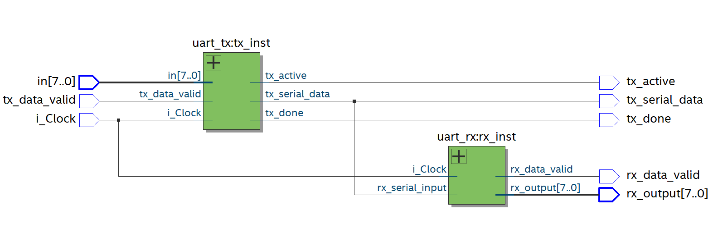
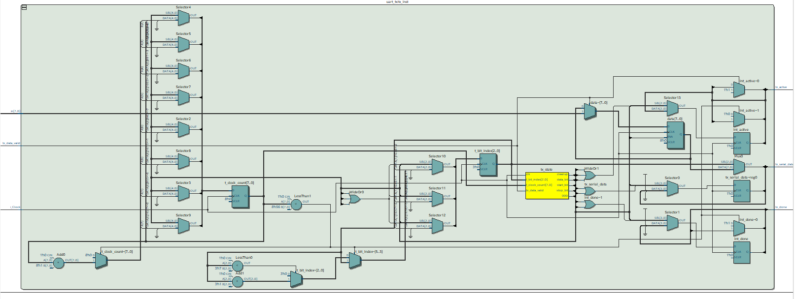
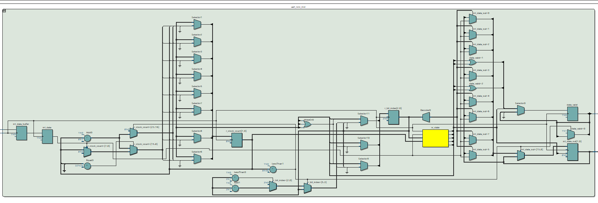

# UART
 Universal asynchronous receiver transmitter. This project was made using Verilog, synthesized using Vivado, and implemented on Nexys 4 FPGA. 
 
* The uart_tx file contains the code for the transmitter module
* uart_rx is for the receiver module
* uart_top is the top-level module file specifying connections between input, transmitter, receiver, and output data. 
* uart_tb is the testbench specifying input data to test the proper functioning of UART.  

The gate level netlist of the UART is shown below:  
  
The internal netlist for the receiver module:   
    
The internal netlist for the transmitter module:   
    
